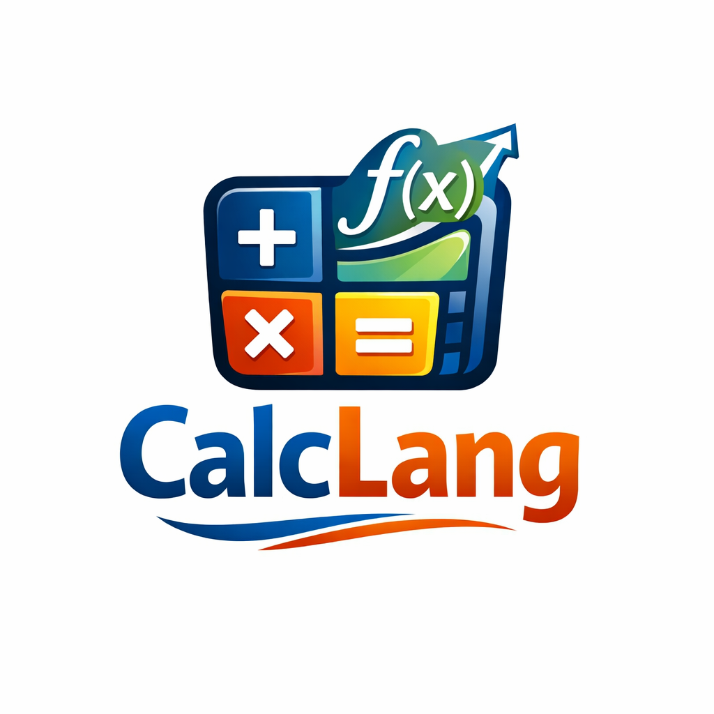
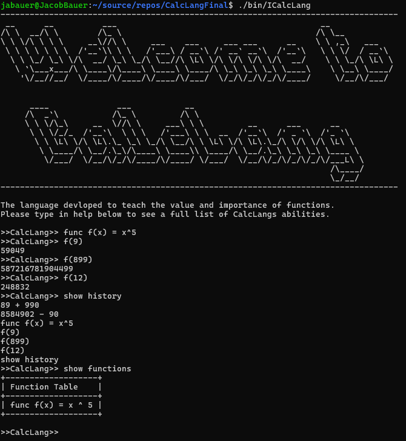
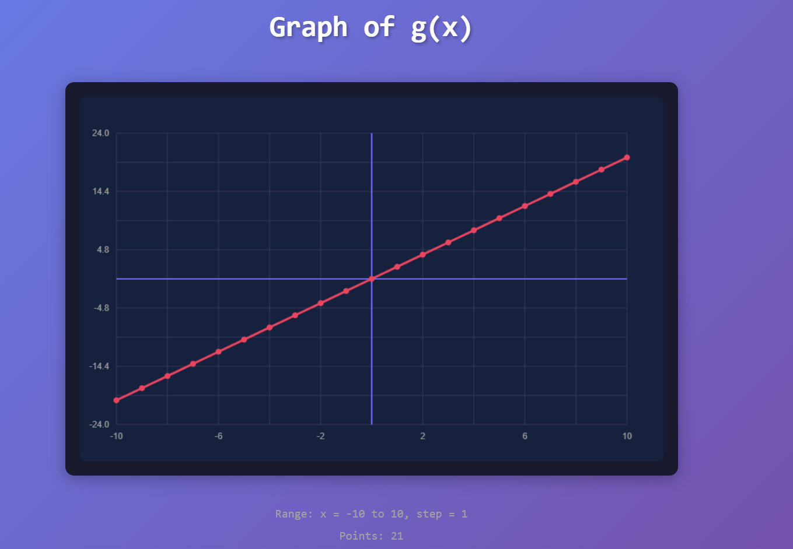
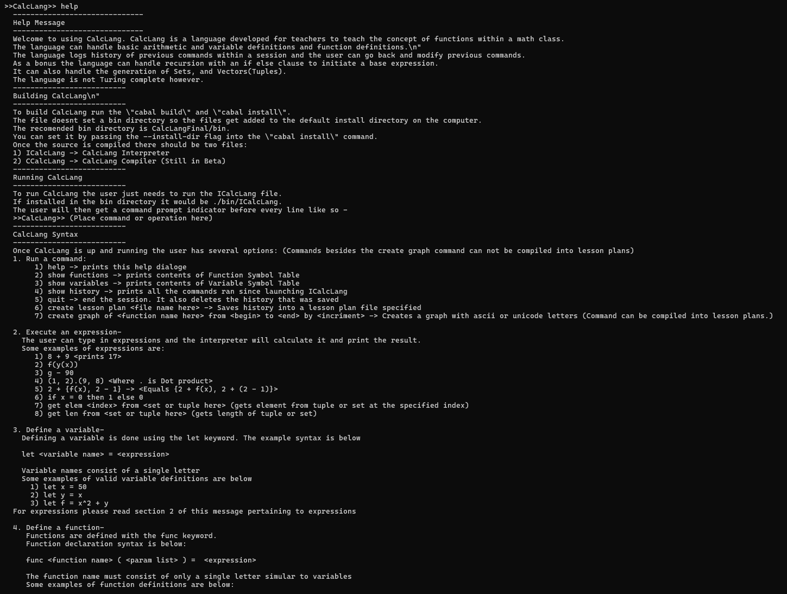

<!-- Improved compatibility of back to top link: See: https://github.com/othneildrew/Best-README-Template/pull/73 -->
<a id="readme-top"></a>
<!--
*** Thanks for checking out the Best-README-Template. If you have a suggestion
*** that would make this better, please fork the repo and create a pull request
*** or simply open an issue with the tag "enhancement".
*** Don't forget to give the project a star!
*** Thanks again! Now go create something AMAZING! :D
-->


<!-- PROJECT SHIELDS -->
<!--
*** I'm using markdown "reference style" links for readability.
*** Reference links are enclosed in brackets [ ] instead of parentheses ( ).
*** See the bottom of this document for the declaration of the reference variables
*** for contributors-url, forks-url, etc. This is an optional, concise syntax you may use.
*** https://www.markdownguide.org/basic-syntax/#reference-style-links
-->
[![Contributors][contributors-shield]][contributors-url]
[![Forks][forks-shield]][forks-url]
[![Stargazers][stars-shield]][stars-url]
[![Issues][issues-shield]][issues-url]
[![project_license][license-shield]][license-url]
[![LinkedIn][linkedin-shield]][linkedin-url]


<!-- PROJECT LOGO -->
<br />
<div align="center">
  <a href="https://github.com/github_username/repo_name">
    
  </a>

<h3 align="center">CalcLang</h3>
  
  <p align="center">
  Welcome to using CalcLang. CalcLang is a language developed for teachers to teach the concept of functions within a math class.
  The language can handle basic arithmetic and variable definitions and function definitions.\n"
  The language logs history of previous commands within a session and the user can go back and modify previous commands.
  As a bonus the language can handle recursion with an if else clause to initiate a base expression.
  It can also handle the generation of Sets, and Vectors(Tuples).
    <br />
    <a href="https://github.com/jabauer1998/CalcLangFinal"><strong>Explore the docs »</strong></a>
    <br />
    <a href="https://github.com/jabauer1998/CalcLangFinal/issues/new?labels=bug&template=bug-report---.md">Report Bug</a>
    &middot;
    <a href="https://github.com/jabauer1998/CalcLangFinal/issues/new?labels=enhancement&template=feature-request---.md">Request Feature</a>
  </p>
</div>

<!-- TABLE OF CONTENTS -->
<details>
  <summary>Table of Contents</summary>
  <ol>
    <li>
      <a href="#about-the-project">About The Project</a>
      <ul>
        <li><a href="#built-with">Built With</a></li>
      </ul>
    </li>
    <li>
      <a href="#getting-started">Getting Started</a>
      <ul>
        <li><a href="#prerequisites">Prerequisites</a></li>
      </ul>
    </li>
    <li><a href="#usage">Usage</a></li>
    <li><a href="#roadmap">Roadmap</a></li>
    <li><a href="#contributing">Contributing</a></li>
    <li><a href="#license">License</a></li>
    <li><a href="#contact">Contact</a></li>
    <li><a href="#acknowledgments">Acknowledgments</a></li>
  </ol>
</details>


<!-- ABOUT THE PROJECT -->
## About The Project

### Haskell
-- In this version of CalcLang the lexer and the Parser are generated with Parsec Monadic Parser Combinator Library

--The main difference with this version is that defining function syntax is slightly different.
--Scala -> it is f(x) = expr
--Haskell -> it is func f(x) = expr

The reason I did this was because the parser generator said their was an ambiguity which was something I was able to get out when I wrote my own grammer.

Speaking of the grammar the grammar of CalcLang is below

Taken from haskell parser generator

  <p>Line -> Ident '=' Expression 'end'                      (1)<br>
	Line -> Ident '(' Paramaters ')' '=' Expression 'end'   (2)<br>
	Line -> Expression 'end'                                (3)<br>
	Paramaters -> Ident                                     (4)<br>
    Paramaters -> Paramaters ',' Ident                      (5)<br>
	Expression -> Logical 'for' Logical 'else' Expression   (6)<br>
	Expression -> Logical                              (7)<br>
	Logical -> Logical 'and' Relational                (8)<br>
	Logical -> Logical 'or' Relational                 (9)<br>
	Logical -> Relational                              (10)<br>
	Relational -> Expr1 '<' Expr1                      (11)<br>
	Relational -> Expr1 '>' Expr1                      (12)<br>
	Relational -> Expr1 '<=' Expr1                     (13)<br>
	Relational -> Expr1 '>=' Expr1                     (14)<br>
	Relational -> Expr1 '!=' Expr1                     (15)<br>
	Relational -> Expr1 '==' Expr1                     (16)<br>
	Relational -> Expr1                                (17)<br>
	Expr1 -> Expr1 '+' Term                            (18)<br>
	Expr1 -> Expr1 '-' Term                            (19)<br>
	Expr1 -> Term                                      (20)<br>
	Term -> Term '*' Unary                             (21)<br>
	Term -> Term '/' Unary                             (22)<br>
	Term -> Term '.' Unary                             (23)<br>
	Term -> Unary                                      (24)<br>
	Unary -> '-' Unary                                 (25)<br>
	Unary -> 'not' Unary                               (26)<br>
    Unary -> '+' Unary                                 (27)<br>
	Unary -> Power                                     (28)<br>
	Power -> Primary '^' Power                         (29)<br>
	Power -> Primary                                   (30)<br>
	Primary -> '(' Expression ')'                      (31)<br>
	Primary -> '(' Expressions ')'                     (32)<br>
	Primary -> '(' Applications ')' '(' Expressions ')'   (33)<br>
	Primary -> '{' Expressions '}'                     (34)<br>
	Primary -> Ident '(' Expressions ')'               (35)<br>
	Primary -> Ident                                   (36)<br>
	Primary -> '$' Number                              (37)<br>
	Primary -> Number '%'                              (38)<br>
	Primary -> Number                                  (39)<br>
	Number -> IntT                                     (40)<br>
	Number -> RealT                                    (41)<br>
	Expressions -> Expression                          (42)<br>
	Expressions -> Expressions ',' Expression          (43)<br>
	Applications -> Ident                              (44)<br>
	Applications -> Applications 'o' Ident             (45)</p>

### An example of the CalcLang Interpreter Intro

### An example of the CalcLang Web Version

### An example of the Help Command


<p>Like stated above and like the name suggests CalcLang is a Calculator and Math oriented Language that allows the user to generate math constructs. There are two ways that a student can access CalcLang. They can download the GitRepo and run the Interpreter or the ICalcLang exe. They can also access a Web version by cicking <a href="https://calc-lang-final-JacobBauer5.replit.app">here</a>.</p>

<p align="right">(<a href="#readme-top">back to top</a>)</p>

### Built With

* [![Haskell][Haskell.hs]][Haskell-url]
* [![C][C.c]][C-url]
* [Cabal](https://www.haskell.org/cabal) - I would install with GhcUp
* [Gnu Make](https://www.gnu.org/software/make) - Optional wrapper around Cabal
* [LLVM](https://llvm.org) - Used for Code Gen

<p align="right">(<a href="#readme-top">back to top</a>)</p>


<!-- GETTING STARTED -->
## Getting Started

1) To get started install git and if you have git clone the repository like so
    ```
    git clone https://github.com/jabauer1998/CalcLang.git
    ```

2) After that change directory into the parent directory called CalcLang.
3) Once in that directory you can run the command:

    For linux users:
    ```
    make
    ```

6) To run the sample demo run the follwing command:

    Run as Terminal Application:
    ```
    ./bin/ICalcLang
    ```

    Run as Web application:
    ```
    ./bin/WCalcLang
    ```
### Prerequisites
* Can only run on Linux as of now

* Git

  For Linux: run the following command
  ```
  apt-get install git
  ```


<!-- USAGE EXAMPLES -->
## Usage

Use this space to show useful examples of how a project can be used. Additional screenshots, code examples and demos work well in this space. You may also link to more resources.

_For more examples, please refer to the [Documentation](https://example.com)_

<p align="right">(<a href="#readme-top">back to top</a>)</p>


<!-- ROADMAP -->
## Roadmap

- [ ] Add functionality for Applications

See the [open issues](https://github.com/jabauer1998/EdeGen/issues) for a full list of proposed features (and known issues).

<p align="right">(<a href="#readme-top">back to top</a>)</p>


<!-- CONTRIBUTING -->
## Contributing

Contributions are what make the open source community such an amazing place to learn, inspire, and create. Any contributions you make are **greatly appreciated**.

If you have a suggestion that would make this better, please fork the repo and create a pull request. You can also simply open an issue with the tag "enhancement".
Don't forget to give the project a star! Thanks again!

1. Fork the Project
2. Create your Feature Branch (`git checkout -b feature/AmazingFeature`)
3. Commit your Changes (`git commit -m 'Add some AmazingFeature'`)
4. Push to the Branch (`git push origin feature/AmazingFeature`)
5. Open a Pull Request

<p align="right">(<a href="#readme-top">back to top</a>)</p>

### Top contributors:

<a href="https://github.com/jabauer1998/EdeStl/graphs/contributors">
  
</a>


<!-- LICENSE -->
## License

Distributed under the project_license. See `LICENSE.txt` for more information.

<p align="right">(<a href="#readme-top">back to top</a>)</p>


<!-- CONTACT -->
## Contact

Jacob Bauer - jabauer.1998@gmail.com

Project Link: [https://github.com/jabauer1998/EdeStl](https://github.com/jabauer1998/EdeGen)

<p align="right">(<a href="#readme-top">back to top</a>)</p>


<!-- ACKNOWLEDGMENTS -->
## Acknowledgments

* [DePauw CS Department](https://www.depauw.edu/academics/majors-and-minors/about-computer-science/faculty-and-staff)
* [PEP 9/Computer Systems By J Stanley Warford](https://computersystemsbook.com/5th-edition/pep9)
* [Dragon Book](https://en.wikipedia.org/wiki/Compilers:_Principles,_Techniques,_and_Tools)

<p align="right">(<a href="#readme-top">back to top</a>)</p>


<!-- MARKDOWN LINKS & IMAGES -->
<!-- https://www.markdownguide.org/basic-syntax/#reference-style-links -->
[contributors-shield]: https://img.shields.io/github/contributors/jabauer1998/CalcLangFinal.svg?style=for-the-badge
[contributors-url]: https://github.com/jabauer1998/CalcLangFinal/graphs/contributors
[forks-shield]: https://img.shields.io/github/forks/jabauer1998/CalcLangFinal.svg?style=for-the-badge
[forks-url]: https://github.com/jabauer1998/EdeGen/network/members
[stars-shield]: https://img.shields.io/github/stars/jabauer1998/CalcLangFinal.svg?style=for-the-badge
[stars-url]: https://github.com/jabauer1998/CalcLangFinal/stargazers
[issues-shield]: https://img.shields.io/github/issues/jabauer1998/CalcLangFinal.svg?style=for-the-badge
[issues-url]: https://github.com/jabauer1998/CalcLangFinal/issues
[license-shield]: https://img.shields.io/github/license/jabauer1998/CalcLangFinal.svg?style=for-the-badge
[license-url]: https://github.com/jabauer1998/CalcLangFinal/LICENSE.txt
[linkedin-shield]: https://img.shields.io/badge/-LinkedIn-black.svg?style=for-the-badge&logo=linkedin&colorB=555
[linkedin-url]: https://www.linkedin.com/in/jacobbauer13
[Haskell.hs]: https://img.shields.io/badge/Haskell-5D4F85?style=for-the-badge&logo=haskell&logoColor=white
[Haskell-url]: https://www.haskell.org/ghcup/install
[C.c]: https://img.shields.io/badge/c-%2300599C.svg?style=for-the-badge&logo=c&logoColor=white
[C-url]: https://clang.llvm.org/get_started.html
